# Secure Authentication System

<p align="center">


</p>

A Flask authentication system implementing the security mechanisms found in production login flows: hashed passwords, email verification, TOTP-based two-factor authentication, brute-force lockout, and login history tracking — built as a security-focused portfolio project, not a tutorial clone.

---

## Features

**Authentication**
- Registration, login, logout, "Remember Me"
- Password hashing with bcrypt (salted automatically)
- Session management via Flask-Login

**Email Verification**
- Accounts must verify their email before login is allowed
- Signed, expiring verification tokens; resend supported

**Password Management**
- Forgot/reset password via emailed signed token
- Change password (invalidates the previous one)
- Strength validation: length, case, digit, and symbol requirements enforced server-side

**Two-Factor Authentication**
- TOTP-based (Google Authenticator compatible), via PyOTP + QR code enrollment
- Enable/disable from account settings; required at login once active

**Account Security**
- Failed-login tracking with temporary lockout after repeated attempts
- Login history: timestamp, browser, OS, IP, and status per attempt
- Rate limiting on authentication endpoints (Flask-Limiter)
- CSRF protection (Flask-WTF) on every state-changing route

**User Area**
- Dashboard, profile management, security center, login history view

---

## Screenshots

| | |
|---|---|
| 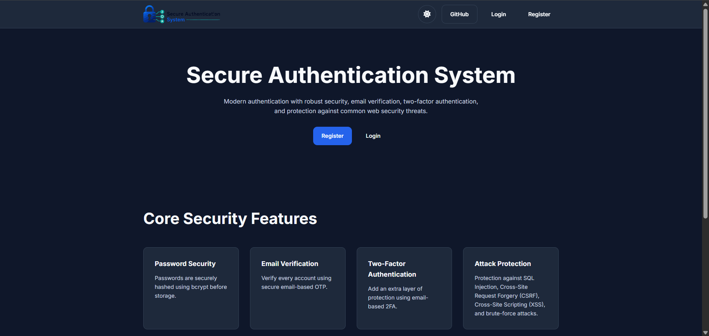 Home | 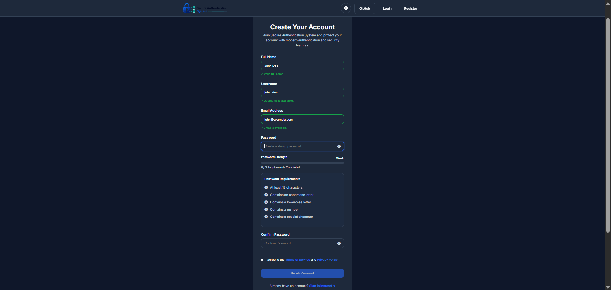 Registration |
| 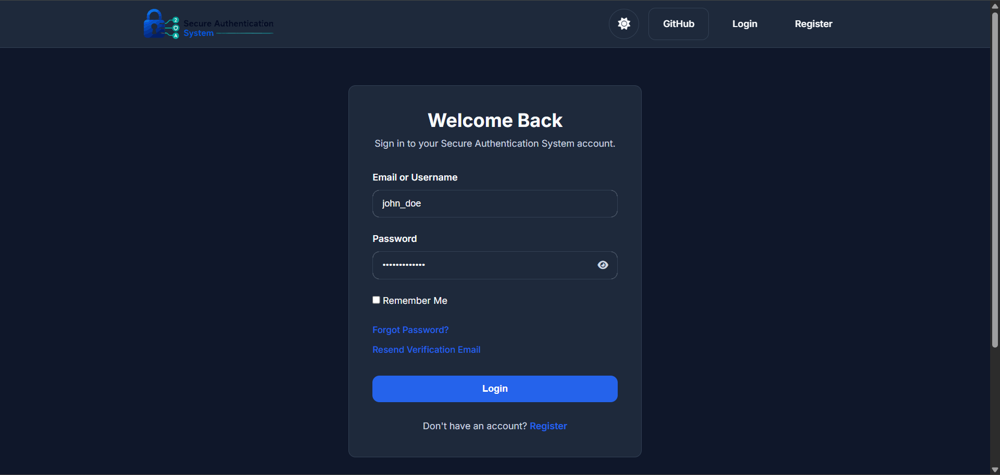 Login | 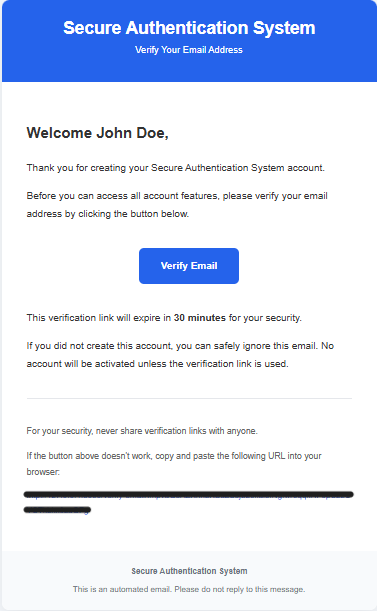 Email Verification |
| 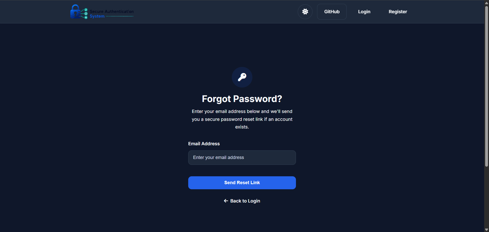 Forgot Password | 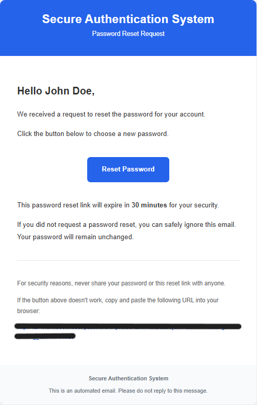 Reset Password |
| 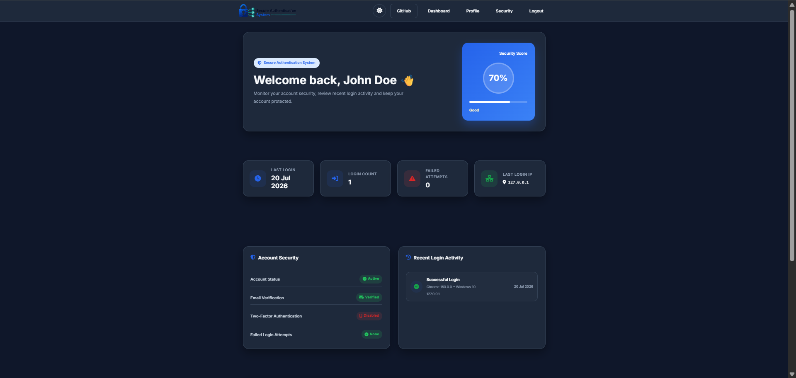 Dashboard | 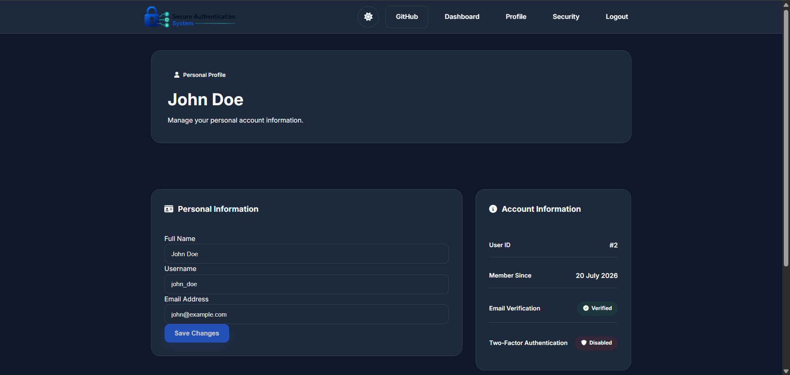 Profile |
| 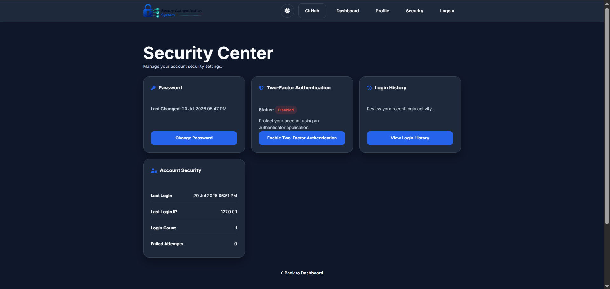 Security Center | 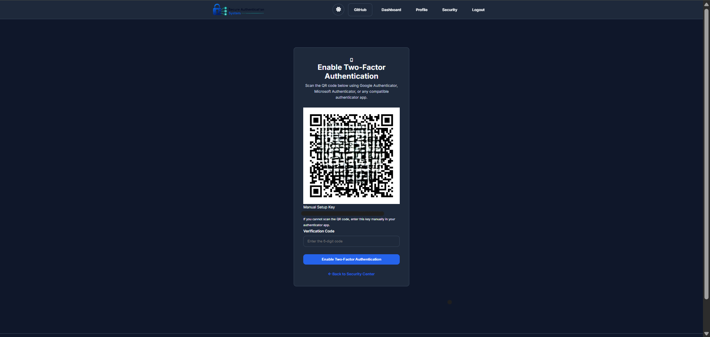 Enable 2FA |
| 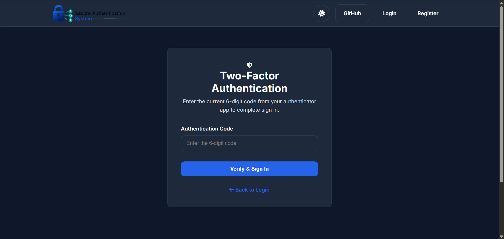 Verify 2FA | 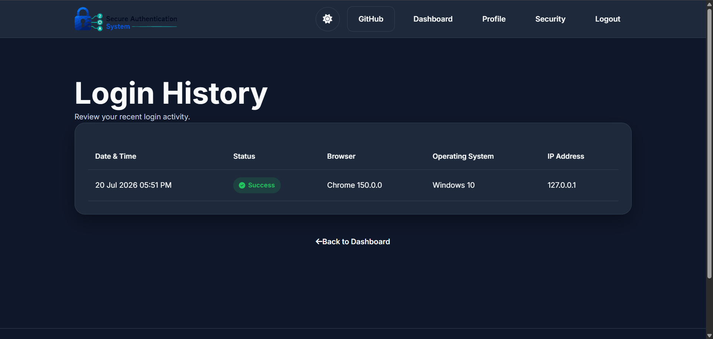 Login History |
| 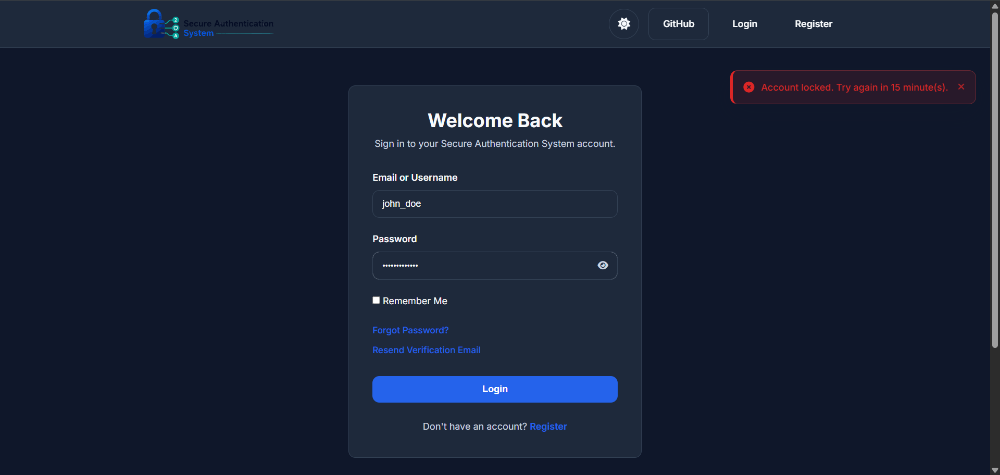 Account Lockout | |

---

## Authentication Flow

```
Register → Email Verification → Login Request
                                       │
                          Email verified? ──No──▶ Access denied
                                       │
                                      Yes
                                       │
                         Password correct? ──No──▶ Failed-login counter
                                       │
                                      Yes
                                       │
                          2FA enabled? ──No──▶ Login success
                                       │
                                      Yes
                                       │
                         Verify OTP ──Invalid──▶ Access denied
                                       │
                                     Valid
                                       │
                                  Dashboard
```

---

## Tech Stack

| Category | Technology |
|---|---|
| Backend | Flask, Python |
| Database | SQLite, SQLAlchemy, Flask-Migrate |
| Auth / Sessions | Flask-Login |
| Forms / CSRF | Flask-WTF |
| Password Hashing | Flask-Bcrypt |
| Email | Flask-Mail |
| 2FA | PyOTP, qrcode |
| Rate Limiting | Flask-Limiter |
| Tokens | itsdangerous |
| Frontend | HTML5, CSS3, JavaScript, Jinja2 |

---

## Project Structure

```
secure-authentication-system/
│
├── authentication/
│   ├── forms/          # Flask-WTF forms (register, login, reset, 2FA...)
│   ├── models/          # User, LoginHistory
│   ├── services/        # Auth, email, login-history, 2FA business logic
│   ├── validators/       # Password / username validation
│   ├── utils/            # Token generation, helpers
│   ├── templates/
│   └── routes.py
│
├── static/{css,js,images}/
├── screenshots/
├── instance/              # SQLite DB, gitignored
├── migrations/            # Flask-Migrate
│
├── app.py
├── config.py
├── requirements.txt
├── .env.example
└── README.md
```

Routes, models, business logic, and validation are kept in separate modules rather than one large `app.py` — this is the same reasoning behind the `detector/`/`training/` split in my [Phishing Email Detector](https://github.com/Pruthil-21/phishing-email-detector) project.

---

## Installation

**Requirements:** Python 3.11+

```bash
git clone https://github.com/Pruthil-21/secure-authentication-system.git
cd secure-authentication-system

python -m venv venv
venv\Scripts\activate        # Windows
source venv/bin/activate     # macOS/Linux

pip install -r requirements.txt
```

Create a `.env` file in the project root:

```env
SECRET_KEY=your_secret_key
SECURITY_PASSWORD_SALT=your_password_salt

MAIL_SERVER=smtp.gmail.com
MAIL_PORT=587
MAIL_USE_TLS=True
MAIL_USERNAME=your_email@gmail.com
MAIL_PASSWORD=your_app_password
MAIL_DEFAULT_SENDER=your_email@gmail.com
```

`.env` is gitignored — never commit real credentials.

## Running

```bash
flask db upgrade   # create/update the database schema
python app.py
```

Then open **http://127.0.0.1:5000**.

---

## Security Notes

- Passwords are hashed with bcrypt and never logged or stored in plaintext.
- Password reset and email verification use signed, time-limited tokens (`itsdangerous`) — not guessable sequential IDs.
- Session identifiers are regenerated on login to prevent session fixation.
- Account lockout is time-based and applies per-account; combined with Flask-Limiter's per-IP limits to reduce both targeted and distributed brute-force attempts.

---

## Future Improvements

- OAuth login (Google/GitHub)
- Backup recovery codes for 2FA
- Active session list with "log out of all devices"
- Login notification emails for new-device sign-ins
- Admin dashboard with audit logs

---

## License

MIT — see `LICENSE`.

## Author

**Pruthil Mistry** — Third-year Computer Engineering student, building toward cybersecurity-focused roles.
[GitHub](https://github.com/Pruthil-21)
[LinkedIn](https://www.linkedin.com/in/pruthilmistry/)
